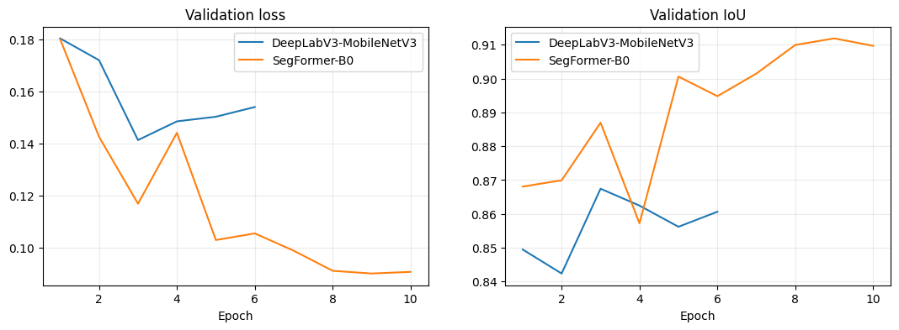
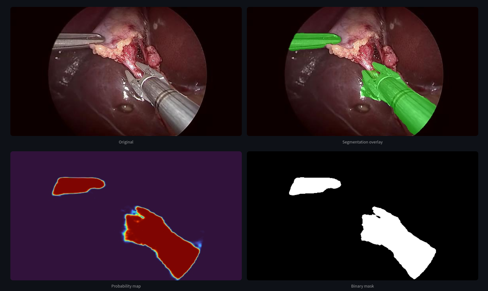
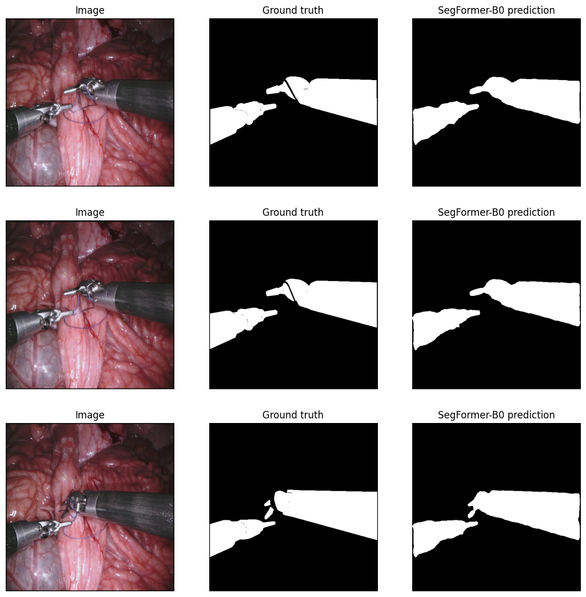

# Surgical Instrument Segmentation — SegFormer-B0

SegFormer-B0 fine-tuned for binary instrument segmentation in endoscopic video, with a Streamlit inference UI.

We also fine-tuned a DeepLabV3-MobileNetV3 baseline for comparison — SegFormer-B0 was selected as the final model based on its superior accuracy and speed.

## Dataset

**EndoVis 2018** (MICCAI Endoscopic Vision Challenge) — 3,000 frames from 10 surgical sequences:
- Sequences 1–8: training (2,400 pairs)
- Sequence 9: validation (300 pairs)
- Sequence 10: test (300 pairs)

Masks contain instrument class IDs (0–7); all non-zero IDs are treated as binary instrument presence. A **CholecT50** subset is used for cross-domain tracking demos.

## Models

SegFormer-B0 (the base variant) was chosen for its compact size, making it suitable for real-time inference on lab hardware with limited GPU resources. A DeepLabV3-MobileNetV3 was also fine-tuned for comparison.

| Model | Validation IoU | Test IoU | Dice | FPS (T4) |
|-------|:-----------:|:-------:|:----:|:------:|
| **SegFormer-B0 (selected)** | **0.9119** | **0.9227** | **0.9598** | **84.6** |
| DeepLabV3-MobileNetV3 | 0.8674 | 0.9048 | 0.9500 | 20.3 |

## Graph Results



## Inference Results



*Sample input image fed to the fine-tuned models for inference.*



*Image, Ground Truth, and SegFormer-B0 Prediction produced on a test image.*

The fine-tuned SegFormer-B0 achieves **92.3% IoU** on the held-out test set at **84.6 FPS**.

## Getting Started

### Requirements

- Python 3.10+
- PyTorch 2.x
- Streamlit

### Install

```bash
pip install -q "transformers>=4.45" "accelerate>=1.0"
pip install torch torchvision streamlit pillow opencv-python matplotlib
```

### Clone & Run

```bash
git clone https://github.com/AliMusavi8/Surgical-Instrument-Segmentation.git
```
```
cd Surgical-Instrument-Segmentation
```
```
pip install transformers accelerate torch torchvision streamlit pillow opencv-python matplotlib
streamlit run app.py
```

The fine-tuned checkpoints are already included in the repo — inference works immediately after cloning.

